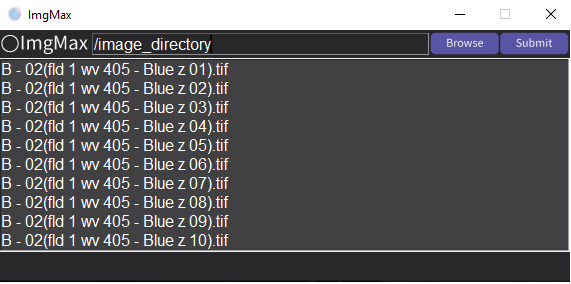
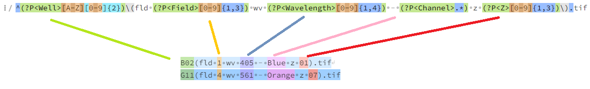
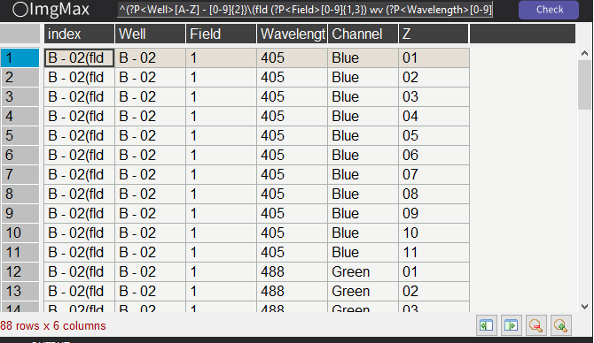
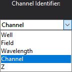
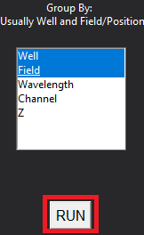
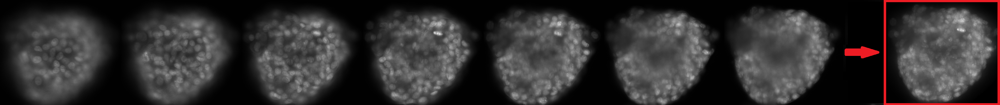

### Rapidly generate maximum intensity projections (MIPs) from an image directory of multi-colour .tif images

How to use:

1. Download ImgMax [Here](https://github.com/charliebidgood/ImgMax/blob/main/release_1_0_0.zip). Click the "download raw" button. Just unzip and run. Keep the .exe in the folder.

2. Start ImgMax and browse to your directory of images

3. Enter the regular expression (RegEx) required to extract the metadata from your image file names. Hint: Use https://regex101.com/ to help you create this. Example Below:

4. Click "Check" and make sure that each column is correctly extracting the appropriate file name components. Double check for odd use-cases (e.g. A1 vs A10 may be difficult).

5. Select the single element which defines your multi-colour channels used to obtain the images . This is important so you don't merge images with different channels (e.g. Brightfield, DAPI, FITC, Cy3, Cy5) together.

6. Select the elements which define unique image groups. In this instance it's 'well' and 'field'. Tip: If you were to only select 'well' you would accidentally merge all images in each well together and ruin the run.

7. If done correctly ImgMax will rapidly create a MIPs each image group and channel and save the new maximum_projection directory next to the original image directory.
